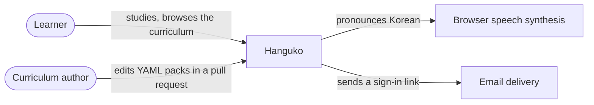
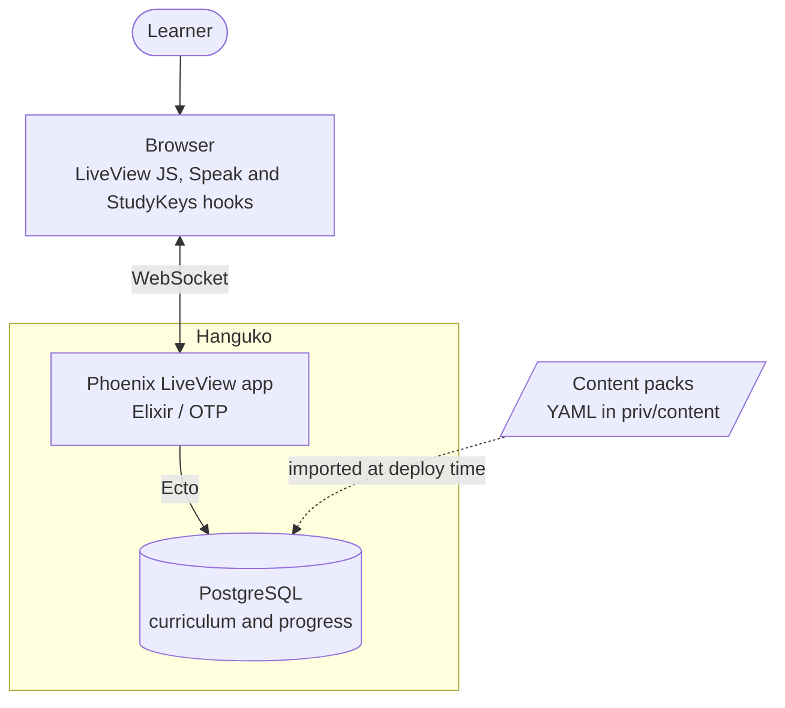
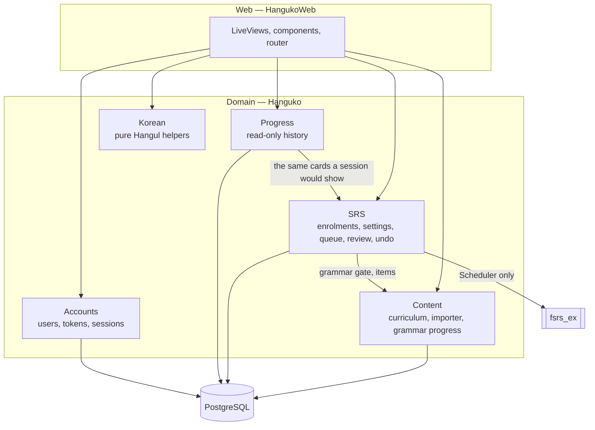

# Architecture

Hanguko is a standard Phoenix 1.8 application: contexts under `lib/hanguko`,
LiveViews under `lib/hanguko_web`, PostgreSQL underneath. This guide is the
shape of the system — three views, from the outside in, and the handful of
rules that cut across all of it. The mechanics of any one part live in the
moduledoc of the module that enforces them, linked from here.

For the tables, see [domain-model.md](domain-model.md); for how a build
reaches production, [deployment.md](deployment.md).

## Context

Two kinds of people use the system, and they meet in the repository rather
than in the app: a learner studies, and an author edits the curriculum as
files that go through code review. There is no admin UI, and that is the
point — see [the central split](#the-central-split).

The outside world it touches is small. Pronunciation is the browser's own
speech synthesis (`assets/js/hooks/speak.js`), which is why nothing has to be
recorded or paid for yet. Sign-in is by magic link, so mail delivery is on the
critical path for logging in; in development it goes to `/dev/mailbox`, and
production delivery is configured through `Hanguko.Mailer` in
`config/runtime.exs`.

## Containers

Everything the learner sees is server-rendered over a LiveView WebSocket.
Only two things have to be client-side, and both are JS hooks in
`assets/js/hooks`: `Speak`, which pronounces Korean, and `StudyKeys`, which
maps the keyboard to a study session. Their headers document the behaviour.

The content packs are a build-time input, not a container the app talks to.
They are read once, by the importer, at deploy time — `bin/migrate` runs
`Hanguko.Release.import_content/0` after the migrations. Nothing in the
running app reads the YAML, which is what lets the curriculum be reviewed
like code without the app depending on a file layout.

## The central split

Everything divides into two halves that meet only through foreign keys:

**Curriculum** is global, read-only at runtime, and lives in the repository
as YAML. Decks, items and grammar points are loaded by
`Hanguko.Content.Importer` — the only writer of curriculum rows. Nothing a
learner does writes to these tables, so a pack can be edited and re-imported
at any time. The importer validates every pack before writing anything and
retires what has left the packs instead of deleting it.

**Progress** is per user and written constantly: enrolments, study settings,
cards and review logs. It refers to curriculum rows by id, which is why
content is never deleted — only retired.

This is what lets the curriculum be reviewed like code (a pull request that
fixes a typo in a sentence) without touching anyone's review history.

## Components

| Context | Responsibility |
| --- | --- |
| `Hanguko.Accounts` | Users, tokens, sessions. Generated by `phx.gen.auth`, unmodified. |
| `Hanguko.Content` | The curriculum: decks, items, grammar points, and the importer. Also grammar progress, since "have I learned this lesson" gates which content is available. |
| `Hanguko.SRS` | Everything per-user about studying: enrolments, settings, the queue, reviewing a card, undo. |
| `Hanguko.Progress` | Read-only views of a learner's history: streaks, daily activity, retention, the forecast and card counts. Computed from `review_logs` and `cards`; stores nothing. |
| `Hanguko.Korean` | Pure Hangul utilities: compose/decompose syllables, batchim detection, romanization, checking typed answers. No database, no dependencies. |

The arrows only point one way, and three boundaries are worth naming because
keeping them is what keeps the diagram true:

* `Hanguko.SRS.Scheduler` is the only module that talks to the FSRS library.
  It converts between our `Card` and the library's and is otherwise pure, so
  changing scheduling algorithms touches one file.
* `Hanguko.Content.Importer` is the only writer of curriculum rows.
* `Hanguko.Korean` depends on nothing at all. Anything that needs a fact
  about Hangul asks it rather than re-deriving the arithmetic.

The study loop lives in `Hanguko.SRS`: `study_queue/3` builds the day's queue,
`HangukoWeb.StudyLive` shows a card, `review_card/5` records the rating in a
transaction and the queue is rebuilt from the database. What that queue
contains and in what order is `Hanguko.SRS.Queue`; what a rating does to a
card's schedule is `Hanguko.SRS.Scheduler`.

### Queries

Each context keeps its queries in a `Queries` module beside it
(`Content.Queries`, `SRS.Queries`, `Progress.Queries`). A query module only
builds `Ecto.Query` structs; the context runs them. So a context reads as
the steps of a task — which rows, then what to do with them — and every
`Repo` call, transaction and lock stays in the context, where it can be seen
next to the work it protects.

This stops short of a repository layer that wraps `Repo.all/insert/update`
for each schema. `Hanguko.Repo` already is that layer, and wrapping it would
hide the transaction boundaries that `SRS.review_card/5` and the importer
depend on.

Query functions come in two shapes:

* **Starting points** name what they return, scoped to a user where the data
  is per-user: `SRS.Queries.review_logs(user_id)`,
  `Content.Queries.active_decks()`.
* **Narrowing functions** take a query and add to it:
  `reviewed_since(query, instant)`, `in_curriculum_order(query)`. They find
  their tables by named binding (`:card`, `:item`, `:deck`, `:log`), so they
  chain onto any query that has the binding, whatever else it joins.

Rules that several queries share live in one place:
`Content.Queries.unlocked_for/2` is the grammar gate, used both for new cards
and for cards already being studied, and `SRS.Day.study_day/3` is the study
day inside SQL.

`Hanguko.Accounts` is left as `phx.gen.auth` generated it, with its token
queries on `UserToken`.

## Scoping

Public functions take a `%Hanguko.Accounts.Scope{}` first, per Phoenix 1.8
convention. A `nil` scope means an anonymous visitor: they can browse the
curriculum, have learned nothing, and get default study settings. Handling
`nil` in the context rather than at the edge is what lets the same
curriculum page serve a visitor and a learner without branching on
authentication.

## Time and the study day

A "day" is per user: a timezone (detected from the browser's `Intl` API
through LiveSocket connect params, overridable in settings) and a rollover
hour, 04:00 by default, so a late-night session still counts as the same day.
The same rule has to hold in Elixir and in SQL, which is why `Hanguko.SRS.Day`
offers both `bounds/3` and the `study_day/3` macro, and why a test checks the
two agree across daylight-saving changes.

The dashboard, study and stats pages all need the settings row on mount and
all detect the time zone first, so they share `HangukoWeb.DetectTimezone` —
an `on_mount` hook attached in the router's `live_session` for those three
routes — rather than each repeating the check and loading the row again.

Every function that depends on the time takes `now` explicitly. Tests pass a
fixed instant and interval fuzz is disabled in the test environment, so
scheduling assertions are exact.

## Web layer

Routes divide along the same line as the data. Browsing the curriculum
(`/hangeul`, `/decks`, `/grammar`, `/phrases`) is public; anything per-user
(`/dashboard`, `/study`, `/study/settings`, `/stats`, `/cards`) requires a
login. Public pages that offer a per-user action — enrol, mark as learned —
send anonymous visitors to the log-in page rather than failing.
`HangukoWeb.Live.PerUserAction` gives that redirect one definition, and the
deck enrol/unenrol toggle that rides along with it another.

Shared UI lives in three component modules: `CoreComponents` (generated),
`HangukoWeb.KoreanComponents` (the Korean font and line-breaking rules, the
speak button, jamo tiles, politeness badges) and `HangukoWeb.StudyComponents`
(rating buttons, queue counts, the daily-limit notice). `HangukoWeb.Labels`,
imported everywhere those are, holds the one table of human-readable names
for the domain's fixed enums, so a filter and the rows it filters read the
same label instead of each naming it separately.

`HangukoWeb.Layouts` documents the navigation, and `HangukoWeb.Nav` the hook
that tells it which section is current.

Every page is laid out for a phone first: the nav collapses to a menu below
1024px, and pages that put controls beside content (the card browser, the
page header, the dashboard's counts) give the content its own line on a
narrow screen. Two rules are easy to undo by accident and so live in
`assets/css/app.css` next to the code that enforces them: Korean text breaks
between words rather than inside them, and form fields are 16px below the
`sm` breakpoint, because mobile Safari zooms the page in on a field with
smaller text and never zooms back out.

`priv/static/manifest.webmanifest` and the icons beside it, linked from the
root layout, let the app be installed to a home screen — its own icon and
window, without browser chrome. There is deliberately no service worker:
studying offline would mean caching the curriculum *and* queueing reviews to
replay, which is a feature in its own right rather than a side effect of the
manifest.

## Testing approach

* **Pure modules** (`Korean`, `Scheduler`) have unit tests plus StreamData
  properties — better ratings never give shorter intervals, and every review
  leaves the card due in the future with a valid memory state.
* **The queue** is tested by constructing cards at known times and asserting
  what comes back, including limits, burying and the rollover hour.
* **The importer** runs against YAML written into a `tmp_dir`, covering
  idempotency, retirement and every error message.
* **`packs_test.exs`** checks the real curriculum: that every letter is
  covered, that phrases carry a valid politeness level, that each example
  sentence contains its cloze exactly once.
* **LiveViews** are tested through `Phoenix.LiveViewTest` at the level a user
  experiences: flip, rate, undo, enrol, mark a lesson learned.

## What comes next

The remaining phases lean on what's already here rather than changing it:
production audio (cloud neural TTS clips that `Speak` already prefers over
browser speech when a page passes one), and listening comprehension built on
that audio.
