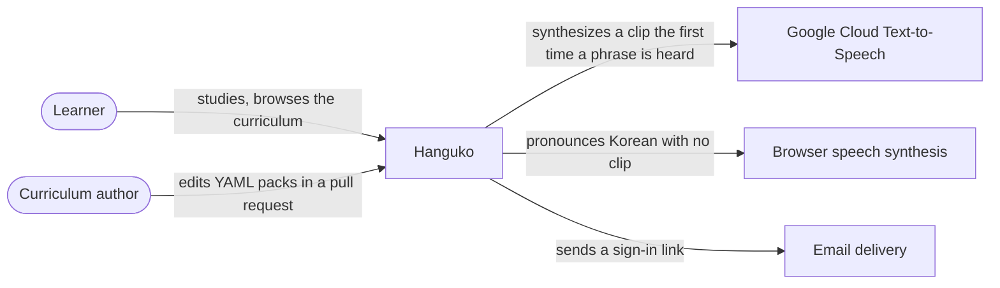
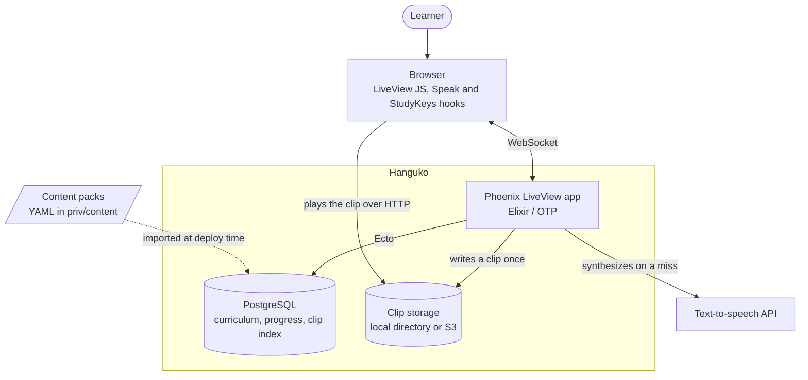
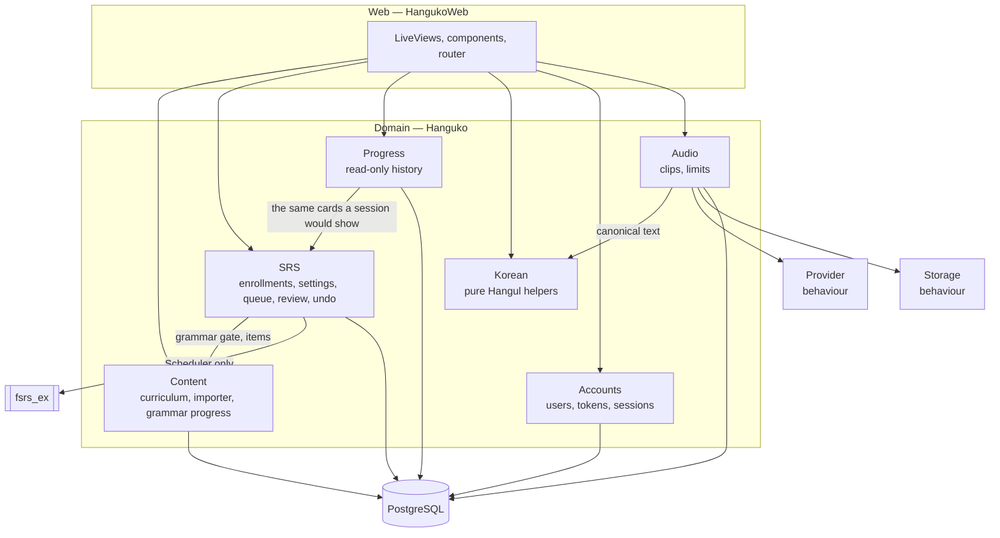
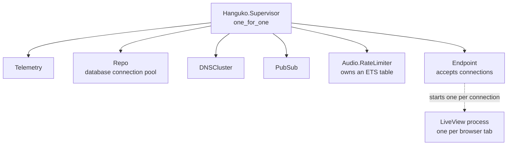

# Architecture

Hanguko is a standard Phoenix 1.8 application: contexts under `lib/hanguko`,
LiveViews under `lib/hanguko_web`, PostgreSQL underneath. This guide is the
shape of the system — three views, from the outside in, and the handful of
rules that cut across all of it. The mechanics of any one part live in the
moduledoc of the module that enforces them, linked from here.

For the tables, see [domain-model.md](domain-model.md); for how a build
reaches production, [deployment.md](deployment.md).

## Context

```mermaid
flowchart LR
  learner([Learner])
  author([Curriculum author])
  app[Hanguko]
  tts[Google Cloud Text-to-Speech]
  speech[Browser speech synthesis]
  mail[Email delivery]

  learner -->|studies, browses the curriculum| app
  author -->|edits YAML packs in a pull request| app
  app -->|synthesizes a clip the first time a phrase is heard| tts
  app -->|pronounces Korean with no clip| speech
  app -->|sends a sign-in link| mail
```

Two kinds of people use the system, and they meet in the repository rather
than in the app: a learner studies, and an author edits the curriculum as
files that go through code review. There is no admin UI, and that is the
point — see [the central split](#the-central-split).

The outside world it touches is small, and only one part of it costs money.
Korean is pronounced from clips that `Hanguko.Audio` has a text-to-speech
provider synthesize the first time a phrase is asked for; everything after
that is a file. The browser's own speech synthesis
(`assets/js/hooks/speak.js`) covers whatever has no clip, so the app runs with
no API key at all — audio quality degrades, nothing breaks. Sign-in is by
magic link, so mail delivery is on the critical path for logging in; in
development it goes to `/dev/mailbox`, and production delivery is configured
through `Hanguko.Mailer` in `config/runtime.exs`.

## Containers

```mermaid
flowchart TB
  learner([Learner])

  subgraph hanguko[Hanguko]
    web["Phoenix LiveView app<br/>Elixir / OTP"]
    db[("PostgreSQL<br/>curriculum, progress, clip index")]
    clips[("Clip storage<br/>local directory or S3")]
  end

  packs[/"Content packs<br/>YAML in priv/content"/]
  browser["Browser<br/>LiveView JS, Speak and StudyKeys hooks"]
  tts["Text-to-speech API"]

  learner --> browser
  browser <-->|WebSocket| web
  web -->|Ecto| db
  web -->|"writes a clip once"| clips
  web -->|"synthesizes on a miss"| tts
  browser -->|"plays the clip over HTTP"| clips
  packs -.->|"imported at deploy time"| db
```

Everything the learner sees is server-rendered over a LiveView WebSocket.
Only two things have to be client-side, and both are JS hooks in
`assets/js/hooks`: `Speak`, which pronounces Korean, and `StudyKeys`, which
maps the keyboard to a study session. Their headers document the behavior.

The content packs are a build-time input, not a container the app talks to.
They are read once, by the importer, at deploy time — `bin/migrate` runs
`Hanguko.Release.import_content/0` after the migrations. Nothing in the
running app reads the YAML, which is what lets the curriculum be reviewed
like code without the app depending on a file layout.

Clip storage is a container of its own because the browser fetches from it
directly: audio bytes never travel over the LiveView socket, and a clip is
served like any other static file. What sits behind it is configuration — a
directory served by the endpoint's `Plug.Static` in development, an
S3-compatible bucket in production — and `Hanguko.Audio.Storage` is the
contract both satisfy. The database holds only the index: one row per clip,
identified by a hash of its text, provider and voice.

## The central split

Everything divides into two halves that meet only through foreign keys:

**Curriculum** is global, read-only at runtime, and lives in the repository
as YAML. Decks, items and grammar points are loaded by
`Hanguko.Content.Importer` — the only writer of curriculum rows. Nothing a
learner does writes to these tables, so a pack can be edited and re-imported
at any time. The importer validates every pack before writing anything and
retires what has left the packs instead of deleting it.

**Progress** is per user and written constantly: enrollments, study settings,
cards and review logs. It refers to curriculum rows by id, which is why
content is never deleted — only retired.

This is what lets the curriculum be reviewed like code (a pull request that
fixes a typo in a sentence) without touching anyone's review history.

## Components

```mermaid
flowchart TB
  subgraph webl["Web — HangukoWeb"]
    lv[LiveViews, components, router]
  end

  subgraph domain["Domain — Hanguko"]
    content["Content<br/>curriculum, importer, grammar progress"]
    srs["SRS<br/>enrollments, settings, queue, review, undo"]
    progress["Progress<br/>read-only history"]
    korean["Korean<br/>pure Hangul helpers"]
    accounts["Accounts<br/>users, tokens, sessions"]
    audio["Audio<br/>clips, limits"]
  end

  provider["Provider<br/>behaviour"]
  storage["Storage<br/>behaviour"]
  fsrs[["fsrs_ex"]]
  db[("PostgreSQL")]

  lv --> content
  lv --> srs
  lv --> progress
  lv --> korean
  lv --> accounts
  lv --> audio
  srs -->|"grammar gate, items"| content
  progress -->|"the same cards a session would show"| srs
  srs -->|"Scheduler only"| fsrs
  audio -->|"canonical text"| korean
  audio --> provider
  audio --> storage
  content --> db
  srs --> db
  progress --> db
  accounts --> db
  audio --> db
```

| Context | Responsibility |
| --- | --- |
| `Hanguko.Accounts` | Users, tokens, sessions. Generated by `phx.gen.auth`, unmodified. |
| `Hanguko.Content` | The curriculum: decks, items, grammar points, and the importer. Also grammar progress, since "have I learned this lesson" gates which content is available. |
| `Hanguko.SRS` | Everything per-user about studying: enrollments, settings, the queue, reviewing a card, undo. |
| `Hanguko.Progress` | Read-only views of a learner's history: streaks, daily activity, retention, the forecast and card counts. Computed from `review_logs` and `cards`; stores nothing. |
| `Hanguko.Korean` | Pure Hangul utilities: compose/decompose syllables, batchim detection, romanization, checking typed answers. No database, no dependencies. |
| `Hanguko.Audio` | Spoken Korean: the clip index, synthesis on a miss, and the limits that keep synthesis from being abused. Clips are shared by every learner, so this is the one per-user-facing context whose rows aren't per user. |

The arrows only point one way, and three boundaries are worth naming because
keeping them is what keeps the diagram true:

* `Hanguko.SRS.Scheduler` is the only module that talks to the FSRS library.
  It converts between our `Card` and the library's and is otherwise pure, so
  changing scheduling algorithms touches one file.
* `Hanguko.Content.Importer` is the only writer of curriculum rows.
* `Hanguko.Korean` depends on nothing at all. Anything that needs a fact
  about Hangul asks it rather than re-deriving the arithmetic.
* `Hanguko.Audio` is the only context with an external dependency that can
  fail or charge money, and the only one that reaches it through behaviours —
  `Hanguko.Audio.Provider` for synthesis and `Hanguko.Audio.Storage` for
  bytes. Neither knows about the other or about the database, so either can
  be swapped or faked alone. Its moduledoc holds the rules that follow from
  that: how a clip is keyed, what happens on a miss, and why audio simply
  turns itself off when no provider is configured.

The study loop lives in `Hanguko.SRS`: `study_queue/3` builds the day's queue,
`HangukoWeb.StudyLive` shows a card, `review_card/5` records the rating in a
transaction and the queue is rebuilt from the database. What that queue
contains and in what order is `Hanguko.SRS.Queue`; what a rating does to a
card's schedule is `Hanguko.SRS.Scheduler`.

### Queries

Each context keeps its queries in a `Queries` module beside it
(`Content.Queries`, `SRS.Queries`, `Progress.Queries`, `Audio.Queries`). A query module only
builds `Ecto.Query` structs; the context runs them. So a context reads as
the steps of a task — which rows, then what to do with them — and every
`Repo` call, transaction and lock stays in the context, where it can be seen
next to the work it protects.

This stops short of a repository layer that wraps `Repo.all/insert/update`
for each schema. `Hanguko.Repo` already is that layer, and wrapping it would
hide the transaction boundaries that `SRS.review_card/5` and the importer
depend on.

Query functions come in two shapes:

* **Starting points** name what they return, scoped to a user where the data
  is per-user: `SRS.Queries.review_logs(user_id)`,
  `Content.Queries.active_decks()`.
* **Narrowing functions** take a query and add to it:
  `reviewed_since(query, instant)`, `in_curriculum_order(query)`. They find
  their tables by named binding (`:card`, `:item`, `:deck`, `:log`), so they
  chain onto any query that has the binding, whatever else it joins.

Rules that several queries share live in one place:
`Content.Queries.unlocked_for/2` is the grammar gate, used both for new cards
and for cards already being studied, and `SRS.Day.study_day/3` is the study
day inside SQL.

`Hanguko.Accounts` is left as `phx.gen.auth` generated it, with its token
queries on `UserToken`.

## Processes and supervision

Almost none of this codebase is written as processes. Contexts are plain
modules whose functions run inside whatever process called them — usually the
LiveView process for that one browser tab, which the framework starts, or a
short-lived request process. State lives in PostgreSQL, so most of the app
needs nothing else, and a module that could be a function is kept a function.

The exception is state that has to be shared, fast and disposable. The
supervision tree in `lib/hanguko/application.ex` names it:

```mermaid
flowchart TB
  sup["Hanguko.Supervisor<br/>one_for_one"]
  tel[Telemetry]
  repo["Repo<br/>database connection pool"]
  dns[DNSCluster]
  pubsub[PubSub]
  limiter["Audio.RateLimiter<br/>owns an ETS table"]
  ep["Endpoint<br/>accepts connections"]
  lv["LiveView process<br/>one per browser tab"]

  sup --> tel
  sup --> repo
  sup --> dns
  sup --> pubsub
  sup --> limiter
  sup --> ep
  ep -.->|"starts one per connection"| lv
```

Children start in order and the endpoint is last, so nothing can serve a
request before the pool and the rate limiter it depends on exist.
`:one_for_one` means a child that crashes is restarted on its own, without
disturbing its siblings.

`Hanguko.Audio.RateLimiter` is the only process this application writes
itself, and it is worth understanding as a pattern rather than as a feature.
It is a `GenServer` that owns a public ETS table. Callers don't send it
messages: they increment counters in the table directly from their own
process, which is what keeps a burst of speak requests from queueing behind a
single mailbox. The process exists because an ETS table needs an owner and
dies with it — putting that owner under the supervisor is what makes the
table's lifetime match the application's. Its moduledoc explains the counting
itself.

Three rules follow from that, and they are the ones to apply when the next
process appears:

* **Reach for a process when something must outlive a single request.** A
  GenServer holding state that could live in the database is a cache with
  extra steps and a second source of truth.
* **A GenServer serializes; ETS doesn't.** Call the process when the work
  must happen one at a time, and hand out an ETS table when many processes
  need the same data at once.
* **Anything in ETS is lost on restart and is per node.** That is acceptable
  for an hourly abuse counter and not for a spending budget, which is why the
  monthly character budget is a query over `audio_clips` rather than a
  counter in memory.

Concurrency elsewhere is per task rather than per process you name. A `Task`
inherits its caller's identity through the `$callers` process key, which is
how work spawned inside a test still reaches that test's sandboxed database
connection — worth knowing before writing a test that spawns anything.

## Scoping

Public functions take a `%Hanguko.Accounts.Scope{}` first, per Phoenix 1.8
convention. A `nil` scope means an anonymous visitor: they can browse the
curriculum, have learned nothing, and get default study settings. Handling
`nil` in the context rather than at the edge is what lets the same
curriculum page serve a visitor and a learner without branching on
authentication.

## Time and the study day

A "day" is per user: a timezone (detected from the browser's `Intl` API
through LiveSocket connect params, overridable in settings) and a rollover
hour, 04:00 by default, so a late-night session still counts as the same day.
The same rule has to hold in Elixir and in SQL, which is why `Hanguko.SRS.Day`
offers both `bounds/3` and the `study_day/3` macro, and why a test checks the
two agree across daylight-saving changes.

The dashboard, study and stats pages all need the settings row on mount and
all detect the time zone first, so they share `HangukoWeb.DetectTimezone` —
an `on_mount` hook attached in the router's `live_session` for those three
routes — rather than each repeating the check and loading the row again.

Every function that depends on the time takes `now` explicitly. Tests pass a
fixed instant and interval fuzz is disabled in the test environment, so
scheduling assertions are exact.

## Web layer

Routes divide along the same line as the data. Browsing the curriculum
(`/hangeul`, `/decks`, `/grammar`, `/phrases`) is public; anything per-user
(`/dashboard`, `/study`, `/study/settings`, `/stats`, `/cards`) requires a
login. Public pages that offer a per-user action — enrol, mark as learned —
send anonymous visitors to the log-in page rather than failing.
`HangukoWeb.Live.PerUserAction` gives that redirect one definition, and the
deck enrol/unenrol toggle that rides along with it another.

Shared UI lives in three component modules: `CoreComponents` (generated),
`HangukoWeb.KoreanComponents` (the Korean font and line-breaking rules, the
speak button, jamo tiles, politeness badges) and `HangukoWeb.StudyComponents`
(rating buttons, queue counts, the daily-limit notice). `HangukoWeb.Labels`,
imported everywhere those are, holds the one table of human-readable names
for the domain's fixed enums, so a filter and the rows it filters read the
same label instead of each naming it separately. `HangukoWeb.Format` is its
counterpart for values rather than enums: pure formatting with no markup, so
a count or an interval reads the same wherever a page shows one instead of
each page growing its own.

`HangukoWeb.Layouts` documents the navigation, and `HangukoWeb.Nav` the hook
that tells it which section is current.

Every page is laid out for a phone first: the nav collapses to a menu below
1024px, and pages that put controls beside content (the card browser, the
page header, the dashboard's counts) give the content its own line on a
narrow screen. Two rules are easy to undo by accident and so live in
`assets/css/app.css` next to the code that enforces them: Korean text breaks
between words rather than inside them, and form fields are 16px below the
`sm` breakpoint, because mobile Safari zooms the page in on a field with
smaller text and never zooms back out.

`priv/static/manifest.webmanifest` and the icons beside it, linked from the
root layout, let the app be installed to a home screen — its own icon and
window, without browser chrome. There is deliberately no service worker:
studying offline would mean caching the curriculum *and* queueing reviews to
replay, which is a feature in its own right rather than a side effect of the
manifest.

## Testing approach

* **Pure modules** (`Korean`, `Scheduler`) have unit tests plus StreamData
  properties — better ratings never give shorter intervals, and every review
  leaves the card due in the future with a valid memory state.
* **The queue** is tested by constructing cards at known times and asserting
  what comes back, including limits, burying and the rollover hour.
* **The importer** runs against YAML written into a `tmp_dir`, covering
  idempotency, retirement and every error message.
* **`packs_test.exs`** checks the real curriculum: that every letter is
  covered, that phrases carry a valid politeness level, that each example
  sentence contains its cloze exactly once.
* **LiveViews** are tested through `Phoenix.LiveViewTest` at the level a user
  experiences: flip, rate, undo, enrol, mark a lesson learned.

## What comes next

Audio is mid-delivery. `Hanguko.Audio` keys, stores and indexes clips, and
`Storage.Local` writes them; what remains is the Google provider itself, the
S3 backend, the rate limiter and budget, the batch generator that pre-renders
the curriculum, and the web wiring that passes a clip URL to each speak
button. Until that last piece lands, pages still fall back to browser speech
everywhere.

After that, listening comprehension builds on the same clips: dialogues need
only a second configured voice, passed as the `:voice` option.
