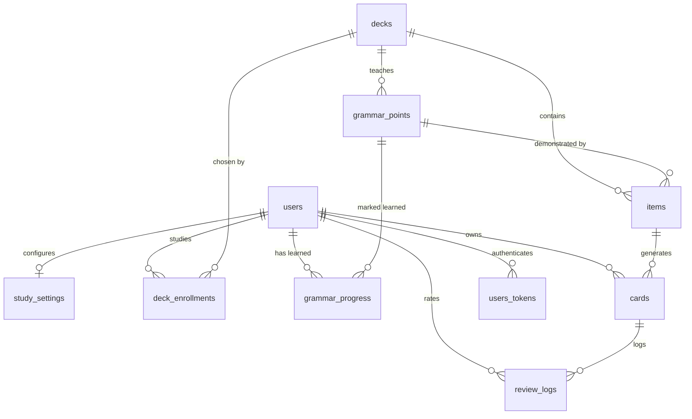

# Domain model

Ten tables in two halves: the curriculum, loaded from `priv/content`, and the
per-user progress built on top of it. All primary keys are `bigserial`, and
all timestamps are `utc_datetime` (second precision).

## Curriculum

These tables are written only by `mix hanguko.content.import`. Rows are never
deleted: content that leaves the packs is marked `retired`, so cards and
review history that point at it stay valid.

### `decks`

A themed collection: "Basic consonants", "Food", "Sentence basics".

| Column | Notes |
| --- | --- |
| `slug` | Unique. Stable identity, and what `/study?deck=…` takes. |
| `title`, `title_ko` | English and Korean names; the Korean one is optional. |
| `kind` | `hangeul`, `vocab`, `phrases`, `sentences`. Also the first sort key of the curriculum. |
| `level`, `position` | Order within a kind. |
| `description` | Shown while browsing. |
| `retired` | Left the packs. |

### `items`

One thing to learn: a letter, a word, a phrase, or an example sentence.

| Column | Notes |
| --- | --- |
| `deck_id` | `on_delete: :restrict` — a deck with items can't be dropped. |
| `source_key` | Unique, `"<deck-slug>/<key>"`. The importer's identity for the row, so an item's text can be corrected without orphaning cards. |
| `kind` | `jamo`, `syllable`, `word`, `phrase`, `sentence`. Decides which card templates exist. |
| `korean` | Required to contain Hangul. |
| `meaning` | Alternative answers separated by `;`. |
| `romanization`, `part_of_speech`, `hint`, `notes` | Optional teaching aids. |
| `tags` | `text[]`, defaults to `{}`. |
| `metadata` | `jsonb`. Letters: `name`, `example_syllable`, `example_word`. Phrases: `politeness`, and optionally `context` (when you'd say it), `literal`, `variant_of`. |
| `grammar_point_id` | Set on example sentences; `on_delete: :restrict`. |
| `cloze` | The part of `korean` blanked out when studied. |
| `position` | Teaching order within the deck. |
| `retired` | Left the packs. |

**Invariant:** if `cloze` is present it appears in `korean` **exactly once**.
Twice would leave it ambiguous which occurrence the blank stands for, so the
changeset rejects it. An empty `cloze:` in a pack means "none".

### `grammar_points`

One pattern taught as a lesson — `-아요/어요`, `-(으)ㄹ 거예요`.

| Column | Notes |
| --- | --- |
| `slug` | Unique identity. |
| `title`, `pattern`, `summary` | What the lesson is called and the shape it takes. |
| `explanation` | Markdown, rendered with raw HTML dropped. |
| `formation` | `jsonb` list of `{when, form, example, batchim}` rows. `batchim` marks the rows chosen by whether a word ends in a consonant. |
| `deck_id` | The deck its example sentences live in, which also places it in the curriculum. |
| `level`, `position` | Default to the deck's level and file order; a pack may set either. |
| `retired` | Left the packs. |

## Progress

Per user, written as they study. Every foreign key to `users` cascades on
delete, so removing an account removes everything it owns.

### `deck_enrollments`

The decks a learner has chosen. New cards come only from these. Unique on
`(user_id, deck_id)`; un-enrolling deletes the row but keeps the cards, which
resume if they enrol again.

### `grammar_progress`

`(user_id, grammar_point_id, learned_at)`, unique on the pair. Marking a
lesson learned unlocks its sentences; un-marking takes them back out of the
queue without touching their history.

### `study_settings`

One row per user, created on first save; a learner with no row gets the
defaults.

| Column | Default | Notes |
| --- | --- | --- |
| `daily_new_limit` | 10 | Shared by all enrolled decks, which take turns filling it. |
| `daily_review_limit` | 200 | Reviews are taken oldest first. |
| `desired_retention` | 0.9 | Passed to FSRS; 0.7–0.97. |
| `timezone` | `nil` | IANA name; `nil` means use the browser's, detected on connect. |
| `day_rollover_hour` | 4 | When a study day starts. |
| `show_romanization` | `true` | |
| `tts_rate` | 0.9 | Speech speed. |

### `cards`

One study direction of one item, with its FSRS memory state. Unique on
`(user_id, item_id, template)`.

| Column | Notes |
| --- | --- |
| `item_id` | `on_delete: :restrict` — studied content stays put. |
| `template` | `recognition` (Korean → meaning), `recall` (meaning → Korean), `cloze` (fill the gap). |
| `state` | `learning`, `review`, `relearning`. |
| `step` | Position in the learning steps (1m, 10m). |
| `stability`, `difficulty` | The FSRS memory state the next interval comes from. |
| `due`, `last_review_at` | Scheduling clock. |
| `reps`, `lapses` | Total reviews, and times a review card was rated Again. |
| `suspended` | Out of the queue without losing history. |
| `introduced_at` | First seen; the daily new-card count counts these within the study day. |

**There is no `new` state.** A new card is one with no row yet: the row is
written the first time the card is rated. Enrolling in a deck costs nothing
until it is studied.

Which templates an item has:

| Item kind | Templates |
| --- | --- |
| `jamo` | `recognition` |
| `word`, `phrase` | `recognition`, then `recall` from the next day |
| `sentence` with a `cloze` | `cloze` |
| anything else | none |

### `review_logs`

One rating, with the card's state on both sides of it. Indexed on
`(user_id, reviewed_at)` and `(card_id)`.

| Column | Notes |
| --- | --- |
| `rating` | 1 Again, 2 Hard, 3 Good, 4 Easy. |
| `reviewed_at` | Drives "reviewed today", the daily review limit, and later, statistics. |
| `duration_ms` | Time spent on the card, capped at 60s. |
| `elapsed_days`, `scheduled_seconds` | Interval in, interval out. |
| `state_before`, `step_before`, `stability_before`, `difficulty_before`, `due_before`, `last_review_before` | The card as it was. |
| `state_after`, `stability_after`, `difficulty_after` | The result. |

The before-half is what makes undo exact. A `nil` `state_before` means the
card was new, so undoing deletes the card rather than restoring it. The
after-half is kept for retention statistics and for optimizing FSRS
parameters against real review history later.

### `users`, `users_tokens`

Generated by `phx.gen.auth`, unchanged. Email is `citext` and unique;
`hashed_password` is null for accounts that only ever use magic links;
`users_tokens` holds session, log-in and change-email tokens, unique on
`(context, token)`.

## Rules worth keeping in mind

* **Content is retired, never deleted.** Both foreign keys from progress into
  curriculum are `restrict`, which enforces it at the database level.
* **Cards appear on first review**, so counts of "new" are computed from the
  absence of rows, not from a status column.
* **An item is studied at most once a day.** The queue buries the sibling
  templates of anything already seen.
* **Example sentences depend on grammar progress** every time the queue is
  built, not only when the card is created.
* **A study day is per user**, from `timezone` and `day_rollover_hour`, so
  "today" is a different UTC window for different people.
* **A phrase deck is a situation.** Every phrase has a `politeness` of
  `formal`, `polite` or `casual`, and a `variant_of` names a different item
  in the same deck, by its full `source_key`. The importer rejects either
  rule being broken.
